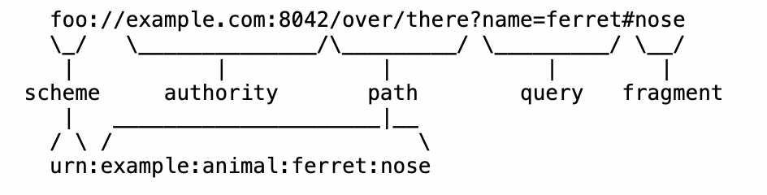

## URI, URL, URN

URL(Resource Locator)  
URN(Resource Name)  
URI(Resource Identifier)  
URI는 URL과 URN을 포함한다.

## Example

## URI

Uniform : 리소스 식별하는 통일된 방식  
Resource : 자원, URI로 식별할 수 있는 모든 것  
Identifier : 다른 항목과 구분하는데 필요한 정보

URL - Locator : 리소스가 있는 위치를 지정  
URN - Name : 리소스에 이름을 부여

## URL 문법

scheme://[userinfo@]host[:port][/path][?query][#fragment]
